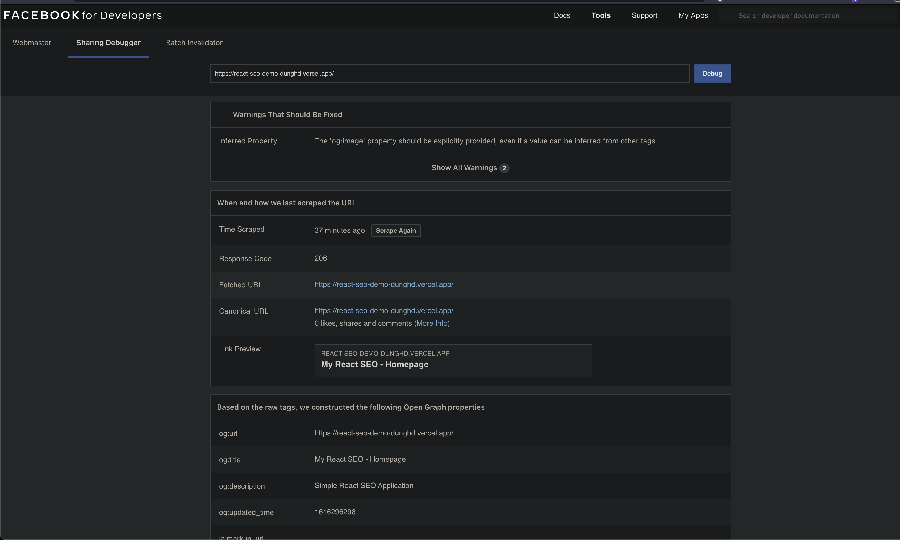

# Welcome to vite-react-seo-demo 👋


[](#)
[](https://twitter.com/jellydn)

> Simple React SEO Demo

[](https://www.youtube.com/watch?v=yVw7ryEqiuI)

### 🏠 [Homepage](https://react-seo-demo-dunghd.vercel.app/)

### ✨ [Demo](https://react-seo-demo-dunghd.vercel.app/)

## Install

```sh
yarn install
```

## Build with

- https://vitejs.dev/ - Next Generation Frontend Tooling
- https://github.com/stereobooster/react-snap - Pre-renders a web app into static HTML. Uses Headless Chrome to crawl all available links starting from the root.
- https://reach.tech/router/ - Reach Router is a small, simple router for React
- https://github.com/nfl/react-helmet - This reusable React component will manage all of your changes to the document head.
- https://github.com/oxalorg/sakura - 🌸 a minimal css framework/theme.

## Usage

```sh
yarn dev
```

## Deploy and testing with Facebook Sharing Debugger

### Deploy to vercel

```sh
yarn build
vercel dist
```

### Debugging with Facebook Sharing Debugger

- Get the deployment link from vercel and test, e.g: https://developers.facebook.com/tools/debug/?q=https%3A%2F%2Freact-seo-demo-dunghd.vercel.app%2F



## Author

👤 **Dung Huynh (dunghd.it@gmail.com)**

- Website: https://productsway.com/
- Twitter: [@jellydn](https://twitter.com/jellydn)
- Github: [@jellydn](https://github.com/jellydn)

## Show your support

Give a ⭐️ if this project helped you!

---

_This README was generated with ❤️ by [readme-md-generator](https://github.com/kefranabg/readme-md-generator)_
